# AWS Network Shell

**AWS Network Tools CLI - A hierarchical CLI for AWS networking**

## 🌟 Overview

AWS Network Shell provides a comprehensive CLI for managing AWS networking resources with a familiar Cisco IOS-style interface. Navigate through contexts (VPC, Transit Gateway, Firewall, etc.) and execute commands with hierarchical command structures.

## 📊 Command Hierarchy

The CLI uses a hierarchical command structure with 9 contexts and 78+ commands:

### Command Structure (Mermaid Diagram)

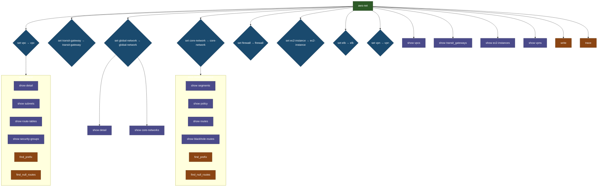

### Command Structure (Mermaid Diagrams)

- **Total Contexts**: 9
- **Total Commands**: 103

#### 1. Overview: Context Navigation

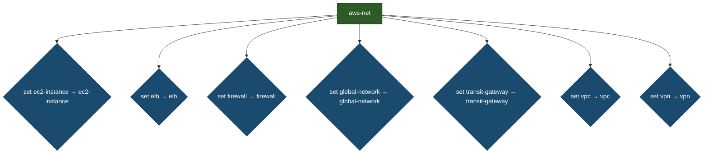

#### 2. Core-Network Context

**Entry**: `set core-network`

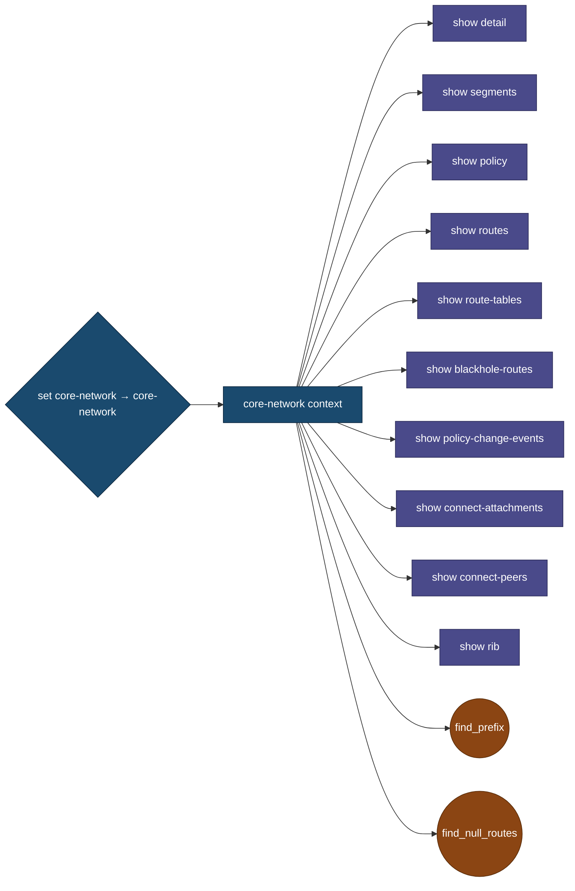

#### 3. Ec2-Instance Context

**Entry**: `set ec2-instance`

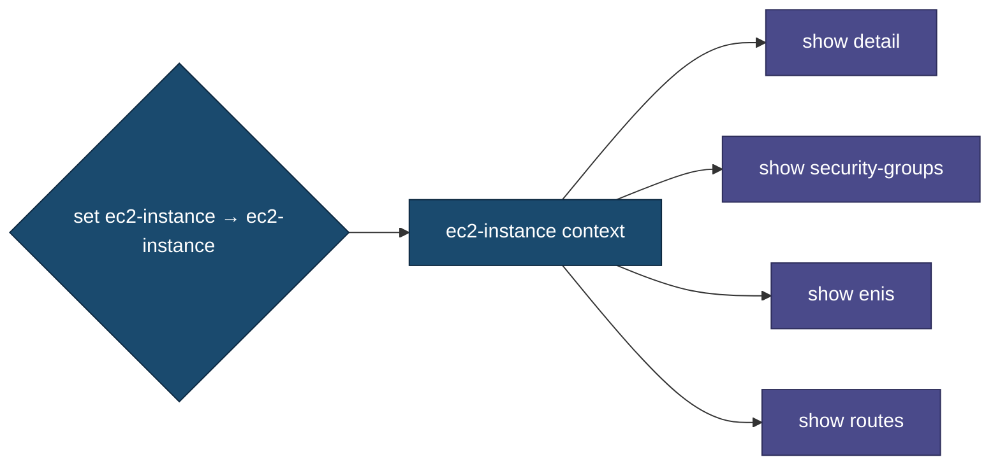

#### 4. Elb Context

**Entry**: `set elb`

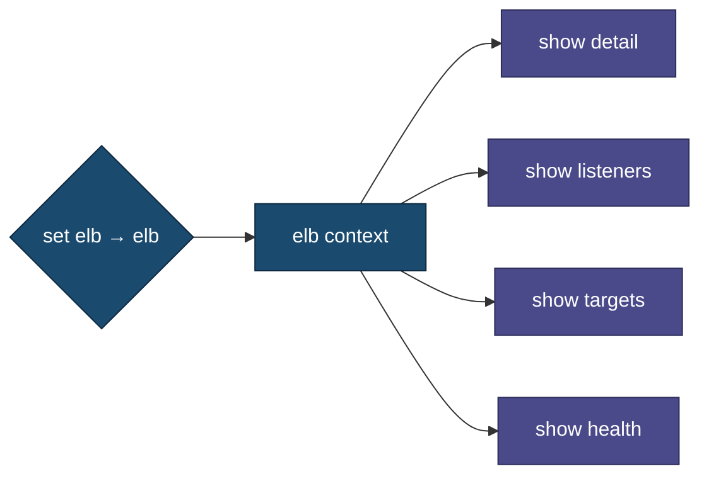

#### 5. Firewall Context

**Entry**: `set firewall`

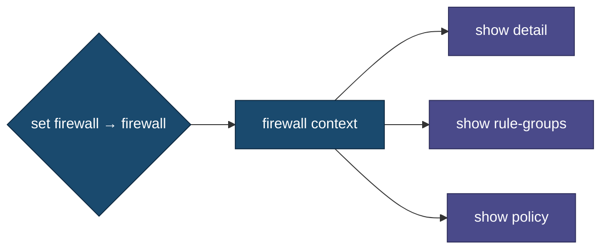

#### 6. Global-Network Context

**Entry**: `set global-network`

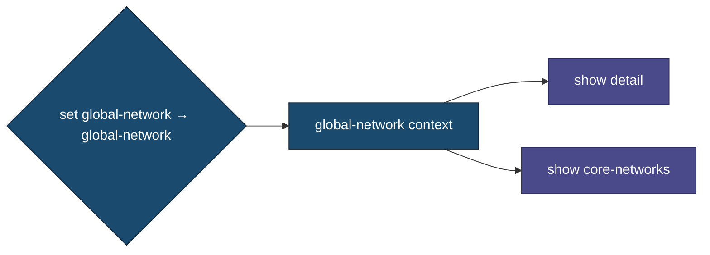

#### 7. Route-Table Context

**Entry**: `set route-table`

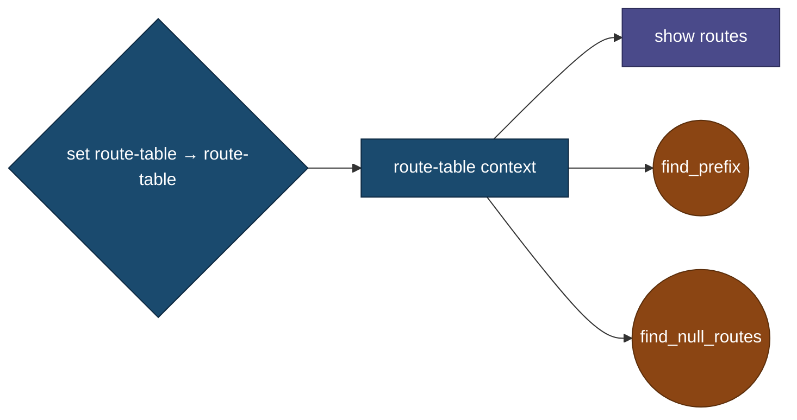

#### 8. Transit-Gateway Context

**Entry**: `set transit-gateway`

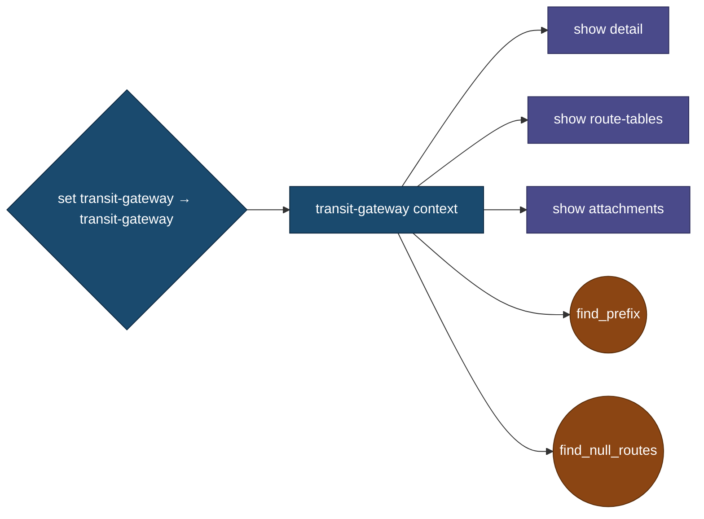

#### 9. Vpc Context

**Entry**: `set vpc`

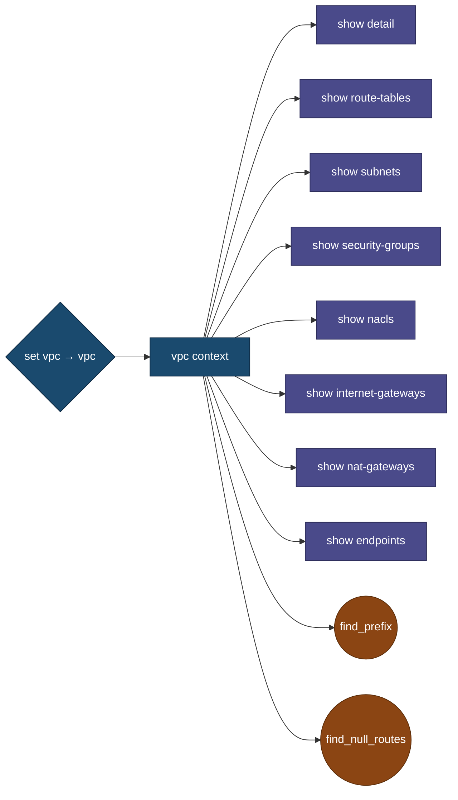

#### 10. Vpn Context

**Entry**: `set vpn`

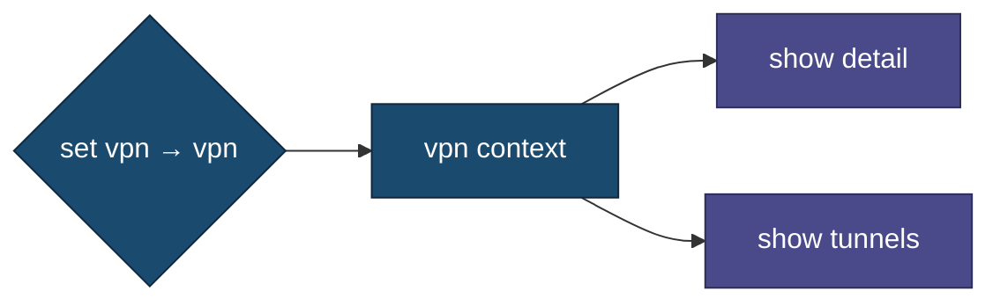

## 📁 Repository Structure

```
aws_net_shell/
├── src/
│   └── aws_network_tools/
│       ├── cli.py                    # CLI entry point
│       ├── core/                     # Core functionality
│       │   ├── base.py              # Base shell class
│       │   ├── graph.py             # Command graph logic
│       │   ├── ip_resolver.py       # IP address resolution
│       │   ├── spinner.py           # Loading spinners
│       │   └── renderer.py          # Output rendering
│       ├── models/                   # Data models
│       ├── modules/                  # AWS service modules
│       ├── shell/                   # Shell implementation
│       │   ├── base.py              # Base shell handlers
│       │   ├── graph.py             # Graph command implementation
│       │   ├── handlers/            # Command handlers by context
│       │   └── main.py              # Main shell entry
│       └── traceroute/              # Traceroute functionality
├── tests/                           # Test suite
│   ├── conftest.py                 # Pytest fixtures
│   ├── test_shell.py               # Shell tests
│   └── test_*.py                   # Unit tests
├── docs/                           # Documentation
│   ├── command-hierarchy-split.md  # Split command diagrams
│   ├── command-hierarchy-flow.md   # Context flow diagrams
│   └── README.md                   # This file
├── README.md                      # Main documentation
├── pyproject.toml                 # Project configuration
└── quick_test.sh                  # Quick test script
```

## 🚀 Installation & Setup

```bash
# Clone repository
cd /Users/taylaand/code/personal/aws_net_shell

# Install dependencies
pip install -e .

# Run AWS network shell
aws-net-shell

# Or with specific profile
aws-net-shell -p production
```

## 🧪 Testing

### Run Tests

```bash
# Run all unit tests
pytest tests/

# Run with verbose output
pytest tests/ -v

# Quick test script
./quick_test.sh
```

### Test Coverage
- **Root commands**: 42 commands
- **Context commands**: 35+ commands
- **Total coverage**: 77+ commands
- **Contexts**: 9 (global-network, vpc, transit-gateway, firewall, ec2-instance, elb, vpn, core-network, route-table)

## 📖 Usage Examples

### Basic Commands
```bash
aws-net> show vpcs
aws-net> show global-networks
aws-net> set vpc 1
aws-net> show detail
```

### Context Navigation
```bash
# Enter VPC context
aws-net> set vpc 1
vpc> show subnets
vpc> show route-tables
vpc> exit

# Enter Transit Gateway context
aws-net> set transit-gateway 1
tgw> show attachments
tgw> show route-tables
tgw> exit
```

### AWS Operations
```bash
# Trace between IPs
aws-net> trace 192.168.1.10 10.0.0.5

# Find IP address
aws-net> find_ip 10.1.32.100

# Find null routes
aws-net> find_null_routes
```

## 📊 Commands by Category

### Show Commands (34)
- Network Resources: `vpcs`, `transit_gateways`, `firewalls`, `elbs`, `vpns`
- Compute: `ec2-instances`, `enis`
- Connectivity: `dx-connections`, `peering-connections`
- Security: `security-groups`, `rule-groups`, `unused-sgs`
- DNS: `resolver-endpoints`, `resolver-rules`
- Monitoring: `network-alarms`, `alarms-critical`
- Global: `global-networks`, `global-accelerators`
- System: `config`, `cache`, `routing-cache`

### Set Commands (8 Contexts)
- `vpc`, `transit-gateway`, `global-network`, `core-network`
- `firewall`, `ec2-instance`, `elb`, `vpn`

### Action Commands (9)
- `write <file>`, `trace <src> <dst>`, `find_ip <ip>`
- `find_prefix <cidr>`, `find_null_routes`
- `reachability`, `populate_cache`, `clear_cache`
- `create-routing-cache`, `export_graph`

## 🔧 Configuration

Default configuration in `pyproject.toml`:
- **Timeout**: 120 seconds per command
- **Regions**: All enabled regions
- **Cache**: Enabled by default
- **Output**: Rich formatted tables

## 🎯 Development

### Adding New Commands

1. Add handler in `src/aws_network_tools/shell/handlers/`
2. Update `HIERARCHY` dict in `src/aws_network_tools/shell/base.py`
3. Run tests: `pytest tests/`

### Testing New Features

```bash
# Run all tests
pytest tests/ -v
```

## 📦 Dependencies

Core dependencies:
- **boto3**: AWS SDK
- **rich**: Terminal formatting
- **cmd2**: Shell framework
- **pytest**: Testing framework

See `pyproject.toml` for full dependency list.

## 📄 License

MIT License - see LICENSE file for details

## 🤝 Contributing

1. Fork the repository
2. Create a feature branch
3. Add comprehensive tests
4. Submit a pull request

## 📝 Changelog

### 2024-12-05
- ✅ ELB commands implementation (listeners, targets, health)
- ✅ VPN context commands (detail, tunnels)
- ✅ Firewall policy command
- ✅ Core-network commands registration fix
- ✅ Direct resource selection without show command
- ✅ Automated issue resolution workflow
- ✅ Consolidated CLI to aws-net-shell only
- ✅ Multi-level context prompt fix
- ✅ Comprehensive testing framework with pexpect integration
- ✅ Graph-based command testing

### 2024-12-02
- ✅ Comprehensive command graph with context navigation
- ✅ Dynamic command discovery (78+ commands)
- ✅ Command graph Mermaid diagrams
- ✅ Test coverage: 77+ commands

---

**Note:** This README is comprehensive and includes the command hierarchy in Mermaid diagram format based on `docs/command-hierarchy-split.md` structure.
