# AWS Network Tools - Architecture & Codemap

**Version**: 1.0.0
**Last Updated**: 2025-12-09

## Table of Contents

1. [Overview](#overview)
2. [System Architecture](#system-architecture)
3. [Module Breakdown](#module-breakdown)
4. [Data Flow](#data-flow)
5. [Core Workflows](#core-workflows)
6. [Extension Guide](#extension-guide)

---

## Overview

AWS Network Tools is a Cisco IOS-style hierarchical CLI for AWS networking resources. The system provides intuitive navigation through AWS network infrastructure with context-aware commands, intelligent caching, and rich visualizations.

### Key Design Principles

1. **Hierarchical Context Management**: Navigate resources like Cisco IOS (enter/exit contexts)
2. **Mixin-Based Architecture**: Composable handlers for each AWS service
3. **Smart Caching**: Multi-level caching with TTL and account safety
4. **Rich UI**: Terminal-based tables, spinners, and colored output
5. **Extensibility**: Module interface for adding new AWS services

### Technology Stack

- **CLI Framework**: cmd2 (command parsing, completion, aliases)
- **UI/Display**: Rich (tables, colors, spinners, theming)
- **AWS SDK**: boto3 with custom retry/timeout configuration
- **Models**: Pydantic for validation and type safety
- **Caching**: File-based JSON cache with TTL

---

## System Architecture

### High-Level Component Diagram

```mermaid
graph TB
    subgraph "User Interface Layer"
        CLI[CLI Entry Point<br/>aws-net-shell]
        Runner[Automation Runner<br/>aws-net-runner]
    end

    subgraph "Shell Layer"
        Base[AWSNetShellBase<br/>Context Management]
        Main[AWSNetShell<br/>Command Routing]
        Handlers[Handler Mixins<br/>Root, CloudWAN, VPC, etc.]
    end

    subgraph "Core Services"
        Cache[Cache System<br/>TTL + Account Safety]
        Display[Display/Renderer<br/>Tables & Formatting]
        Logger[Logging System<br/>Debug + Audit]
        Spinner[UI Feedback<br/>Progress Indicators]
    end

    subgraph "AWS Integration Layer"
        Modules[Service Modules<br/>CloudWAN, VPC, TGW, etc.]
        Models[Data Models<br/>Pydantic Validation]
        BaseClient[BaseClient<br/>boto3 + Config]
    end

    subgraph "External Systems"
        AWS[AWS APIs<br/>CloudWAN, EC2, NetworkManager]
        FileCache[(File Cache<br/>~/.cache/aws-network-tools)]
    end

    CLI --> Main
    Runner --> Main
    Main --> Base
    Main --> Handlers
    Handlers --> Cache
    Handlers --> Display
    Handlers --> Modules
    Modules --> BaseClient
    Modules --> Models
    BaseClient --> AWS
    Cache --> FileCache
    Modules --> Logger
    Main --> Spinner

    style CLI fill:#2d5a27
    style Runner fill:#2d5a27
    style Main fill:#1a4a6e
    style Modules fill:#4a4a8a
    style AWS fill:#ff9900
```

### Directory Structure

```
src/aws_network_tools/
├── cli/                    # Entry points & automation
│   ├── runner.py          # aws-net-runner (non-interactive)
│   └── __init__.py
├── config/                 # Configuration management
│   └── __init__.py        # Theme, prompt, cache settings
├── core/                   # Foundation services
│   ├── base.py            # BaseClient, Context, ModuleInterface
│   ├── cache.py           # File-based cache with TTL
│   ├── cache_db.py        # Database-backed cache (future)
│   ├── decorators.py      # @requires_context, @cached, etc.
│   ├── display.py         # Base display classes
│   ├── ip_resolver.py     # IP/CIDR utilities
│   ├── logging.py         # Structured logging setup
│   ├── renderer.py        # Table rendering engine
│   └── spinner.py         # Progress indicators
├── models/                 # Data validation
│   ├── base.py            # AWSResource, CIDRBlock
│   ├── cloudwan.py        # CoreNetwork, Segment, etc.
│   ├── ec2.py             # Instance, ENI, SecurityGroup
│   ├── tgw.py             # TransitGateway, Attachment
│   └── vpc.py             # VPC, Subnet, RouteTable
├── modules/                # AWS service clients
│   ├── cloudwan.py        # Cloud WAN operations
│   ├── vpc.py             # VPC operations
│   ├── tgw.py             # Transit Gateway operations
│   ├── ec2.py             # EC2 instance operations
│   ├── anfw.py            # Network Firewall operations
│   ├── elb.py             # Load Balancer operations
│   ├── vpn.py             # Site-to-Site VPN operations
│   ├── eni.py             # ENI operations
│   ├── security.py        # Security Groups & NACLs
│   ├── flowlogs.py        # VPC Flow Logs
│   ├── traceroute.py      # Network path tracing
│   └── [15+ other AWS services]
├── shell/                  # CLI implementation
│   ├── base.py            # AWSNetShellBase (context stack, navigation)
│   ├── main.py            # AWSNetShell (command routing)
│   ├── handlers/          # Service-specific command handlers
│   │   ├── root.py        # Root-level commands (show, set, trace)
│   │   ├── cloudwan.py    # CloudWAN context commands
│   │   ├── vpc.py         # VPC context commands
│   │   ├── tgw.py         # Transit Gateway commands
│   │   ├── ec2.py         # EC2 instance commands
│   │   ├── firewall.py    # Firewall context commands
│   │   ├── elb.py         # Load Balancer commands
│   │   ├── vpn.py         # VPN context commands
│   │   └── utilities.py   # Cache, config, graph commands
│   ├── arguments.py       # Argument parsing helpers
│   ├── discovery.py       # Resource discovery utilities
│   └── graph.py           # Command hierarchy graph operations
├── themes/                 # UI theming
│   └── __init__.py        # Theme loading (Catppuccin, Dracula)
└── traceroute/            # Network path analysis
    ├── engine.py          # Path tracing engine
    ├── topology.py        # Topology builder
    ├── models.py          # Hop, Path models
    └── staleness.py       # Cache freshness checks
```

---

## Module Breakdown

### 1. Core Layer (`core/`)

#### `base.py` - Foundation Classes

**Classes**:

- `BaseClient` - Boto3 session management with custom config
  - Handles AWS credentials (profile or default)
  - Standardized retry/timeout configuration
  - Thread pool concurrency control

- `Context` - Shell execution context (dataclass)
  - `type`: Context name (vpc, transit-gateway, etc.)
  - `ref`: Resource identifier (ID or ARN)
  - `name`: Human-readable name
  - `data`: Full resource detail dictionary
  - `selection_index`: User's selection number (1-based)

- `ModuleInterface` - Abstract interface for AWS service modules
  - Defines module contract: name, commands, context_commands, show_commands
  - `execute()` method for command dispatching

**Purpose**: Provides base abstractions used across all layers

#### `cache.py` - File-Based Caching

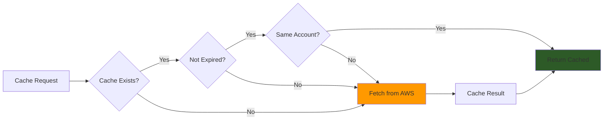

**Classes**:

- `Cache(namespace)` - Namespace-isolated cache
  - `get(ignore_expiry, current_account)` - Retrieve with validation
  - `set(data, ttl_seconds, account_id)` - Store with metadata
  - `clear()` - Delete cache file
  - `get_info()` - Cache metadata (age, TTL, expiry status)

**Features**:

- TTL-based expiration (default 15min, configurable)
- Account safety (auto-clear on account switch)
- Namespace isolation (separate cache per service)
- ISO 8601 timestamps with timezone awareness

**Storage**: `~/.cache/aws-network-tools/{namespace}.json`

#### `decorators.py` - Command Decorators

**Functions**:

- `@requires_context(ctx_type)` - Ensure command runs in correct context
- `@cached(key, ttl)` - Auto-cache function results
- `@spinner(message)` - Show progress spinner during execution

#### `display.py` & `renderer.py` - UI Components

**Classes**:

- `BaseDisplay` - Abstract display interface
  - Defines `show_detail()`, `render_table()` methods
  - Used by service-specific display classes

- `TableRenderer` - Advanced table rendering
  - Nested tables support
  - Column auto-sizing
  - Rich formatting integration

#### `spinner.py` - Progress Feedback

**Functions**:

- `run_with_spinner(fn, message)` - Execute with progress indicator
- Handles exceptions and displays errors gracefully

#### `ip_resolver.py` - Network Utilities

**Functions**:

- IP address parsing and validation
- CIDR manipulation and comparison
- Subnet calculations

---

### 2. Models Layer (`models/`)

Pydantic-based data validation for AWS resources.

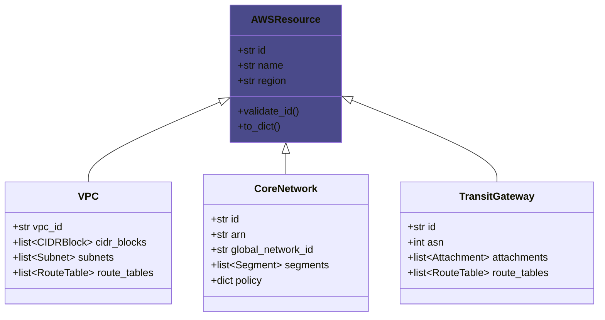

**Purpose**:

- Type-safe data structures
- Automatic validation on construction
- Backward compatibility via `to_dict()`

---

### 3. Modules Layer (`modules/`)

AWS service clients - one module per AWS service.

#### Module Architecture Pattern

```mermaid
graph TB
    subgraph "Module Structure"
        Client[Client Class<br/>AWS API calls]
        Display[Display Class<br/>Terminal rendering]
        Module[Module Class<br/>ModuleInterface impl]
    end

    subgraph "External Dependencies"
        BaseClient[core.BaseClient]
        BaseDisplay[core.BaseDisplay]
        ModuleInterface[core.ModuleInterface]
        Models[models.*]
    end

    Client --> BaseClient
    Display --> BaseDisplay
    Module --> ModuleInterface
    Client --> Models
    Display --> Models
    Module --> Client
    Module --> Display

    style Client fill:#1a4a6e
    style Display fill:#4a4a8a
    style Module fill:#6b4c9a
```

#### Example: CloudWAN Module (`modules/cloudwan.py`)

**Classes**:

1. **`CloudWANClient(BaseClient)`** - AWS API operations
   - `list_global_networks()` → Global Networks
   - `get_core_network(id)` → Core Network details
   - `get_policy(id, version)` → Policy document
   - `list_attachments(id)` → VPC/VPN/Connect attachments
   - `get_routes(id, segment, edge)` → Route tables
   - Multi-region support with concurrent fetching

2. **`CloudWANDisplay(BaseDisplay)`** - Terminal rendering
   - `show_detail(data)` → Core Network overview table
   - `render_segments(segments)` → Segment configuration
   - `render_routes(routes)` → Route table with colors
   - `render_policy(policy)` → Formatted policy YAML

3. **`CloudWANModule(ModuleInterface)`** - Shell integration
   - Declares commands: `global-network`, `core-network`
   - Defines show options per context
   - Implements command execution and context navigation

**Similar patterns for**: VPC, TGW, EC2, Firewall, ELB, VPN, etc.

---

### 4. Shell Layer (`shell/`)

#### Command Processing Flow

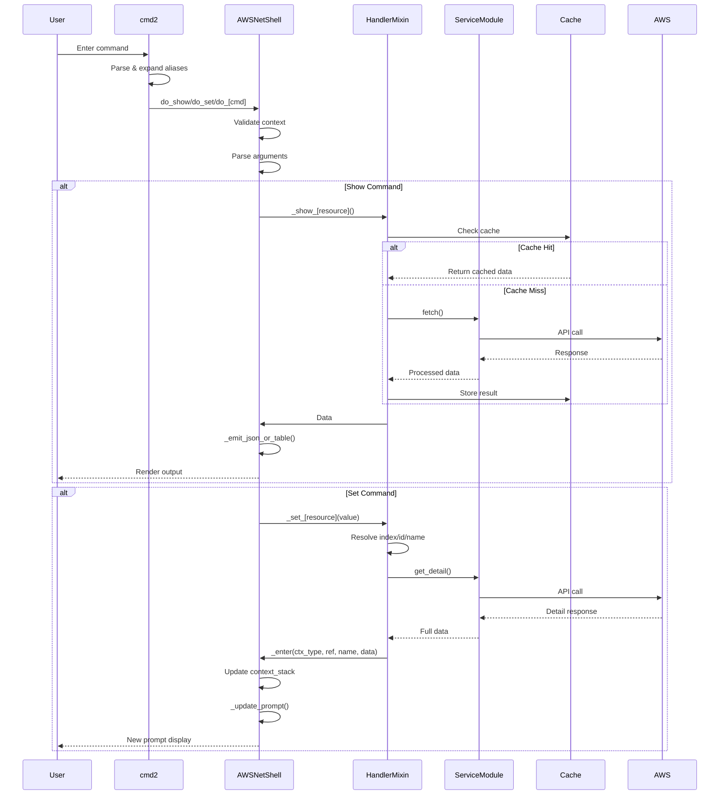

#### `base.py` - AWSNetShellBase

**Core Responsibilities**:

1. **Context Stack Management**
   - `context_stack: list[Context]` - Navigation history
   - `_enter(ctx_type, ref, name, data, index)` - Push context
   - `_exit()` / `_end()` - Pop/clear contexts

2. **Prompt Rendering**
   - `_update_prompt()` - Generate colored prompts
   - Theme-based styling (short vs long format)
   - Multi-line hierarchical display

3. **Command Hierarchy**
   - `HIERARCHY` dict - Valid commands per context
   - `hierarchy` property - Current context's valid commands
   - Validation and help generation

4. **Resource Resolution**
   - `_resolve(items, val)` - Find by index/ID/name
   - 1-based indexing for user convenience

5. **Utility Commands**
   - `do_exit()`, `do_end()`, `do_clear()`
   - `do_clear_cache()`, `do_refresh()`
   - `do_help()`, `default()` (error handling)

#### `main.py` - AWSNetShell

**Mixin Composition**:

```python
class AWSNetShell(
    RootHandlersMixin,      # Root-level: show, set, trace, find_ip
    CloudWANHandlersMixin,  # CloudWAN contexts
    VPCHandlersMixin,       # VPC contexts
    TGWHandlersMixin,       # Transit Gateway contexts
    EC2HandlersMixin,       # EC2 instance contexts
    FirewallHandlersMixin,  # Firewall contexts
    VPNHandlersMixin,       # VPN contexts
    ELBHandlersMixin,       # Load Balancer contexts
    UtilityHandlersMixin,   # Config, cache, graph utilities
    AWSNetShellBase,        # Base context management
):
```

**Key Methods**:

- `_cached(key, fetch_fn, msg)` - Cache wrapper with spinner
- `_emit_json_or_table(data, render_fn)` - Format-aware output
- `do_show(args)` - Route show commands to handlers
- `do_set(args)` - Route set commands to handlers
- `do_find_prefix(args)` - Context-aware prefix search
- `do_find_null_routes()` - Context-aware blackhole detection

#### Handler Mixins (`shell/handlers/`)

Each handler mixin provides commands for a specific AWS service or context.

**Pattern**:

```python
class ServiceHandlersMixin:
    def _show_[resource](self, args):
        """Show resource list or details"""
        data = self._cached("key", lambda: Module().fetch())
        # Render table or JSON

    def _set_[resource](self, val):
        """Enter resource context"""
        items = self._cache.get("key", [])
        item = self._resolve(items, val)
        detail = Module().get_detail(item['id'])
        self._enter("context-type", item['id'], item['name'], detail)
```

**Handler Overview**:

| Handler | Contexts | Commands | AWS Services |
|---------|----------|----------|--------------|
| `root.py` | None (root) | show vpcs, set vpc, trace, find_ip | Multiple |
| `cloudwan.py` | global-network, core-network, route-table | show routes, policy, segments | NetworkManager, CloudWAN |
| `vpc.py` | vpc | show subnets, route-tables, nacls | EC2 (VPC APIs) |
| `tgw.py` | transit-gateway | show attachments, route-tables | EC2 (TGW APIs) |
| `ec2.py` | ec2-instance | show detail, security-groups, enis | EC2 |
| `firewall.py` | firewall, rule-group | show rules, policy | NetworkFirewall |
| `elb.py` | elb | show listeners, targets, health | ELBv2 |
| `vpn.py` | vpn | show tunnels, detail | EC2 (VPN APIs) |
| `utilities.py` | N/A | populate_cache, show cache, graph | Local operations |

---

## Data Flow

### Command Execution Pipeline

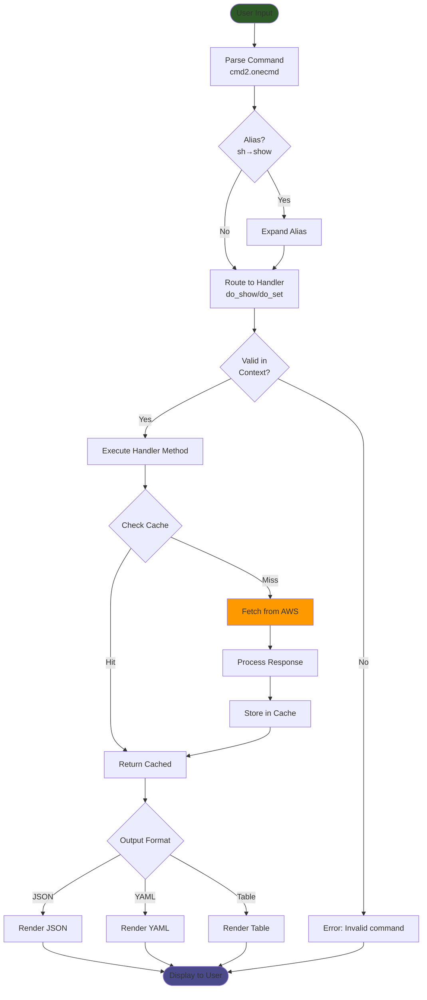

### Context Navigation Flow

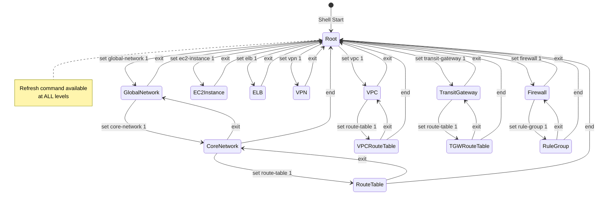

### Cache Architecture

```mermaid
graph TB
    subgraph "Memory Cache Layer"
        MemCache[shell._cache<br/>Dict~str,Any~]
        RefreshCmd[refresh command<br/>Clear specific keys]
    end

    subgraph "File Cache Layer"
        FileCache[Cache class<br/>JSON files]
        TTL[TTL Manager<br/>15min default]
        AccountCheck[Account Validator]
    end

    subgraph "Storage"
        CacheDir[(~/.cache/<br/>aws-network-tools/)]
        ConfigFile[config.json<br/>TTL settings]
    end

    subgraph "Modules"
        CloudWAN[CloudWAN Module]
        VPC[VPC Module]
        TGW[TGW Module]
        Other[Other Modules]
    end

    RefreshCmd --> MemCache
    MemCache --> FileCache
    FileCache --> TTL
    FileCache --> AccountCheck
    FileCache --> CacheDir
    ConfigFile --> TTL

    CloudWAN --> MemCache
    VPC --> MemCache
    TGW --> MemCache
    Other --> MemCache

    style RefreshCmd fill:#2d5a27
    style MemCache fill:#1a4a6e
    style FileCache fill:#4a4a8a
```

**Two-Level Caching**:

1. **Memory Cache** (`self._cache`) - Session-scoped, cleared by refresh
2. **File Cache** (`Cache` class) - Persistent, TTL + account-aware

**Cache Keys**:

- `vpcs`, `transit_gateways`, `firewalls`, `elb`, `vpns`, `ec2_instances`
- `global_networks`, `core_networks`, `enis`
- Namespaced by service type

---

## Core Workflows

### Workflow 1: Resource Discovery & Selection

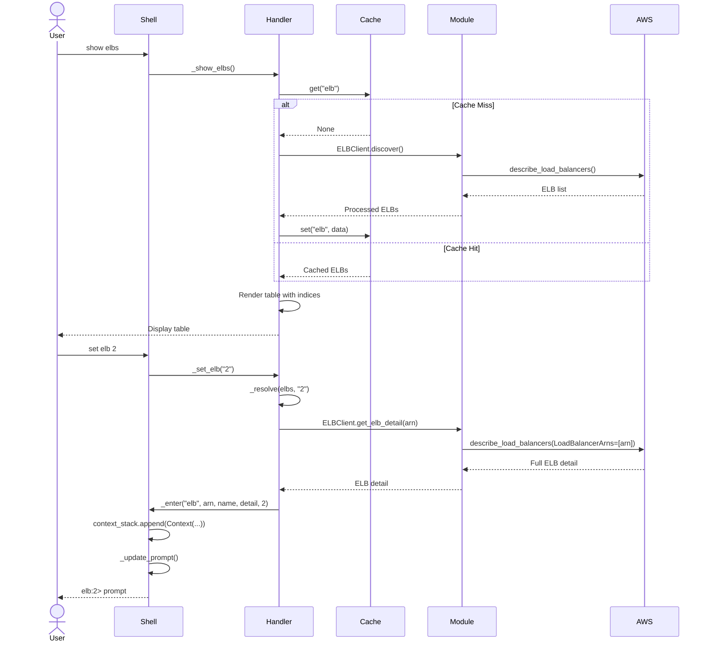

### Workflow 2: Context-Aware Commands

**Scenario**: User runs `find_prefix 10.0.0.0/16` in different contexts

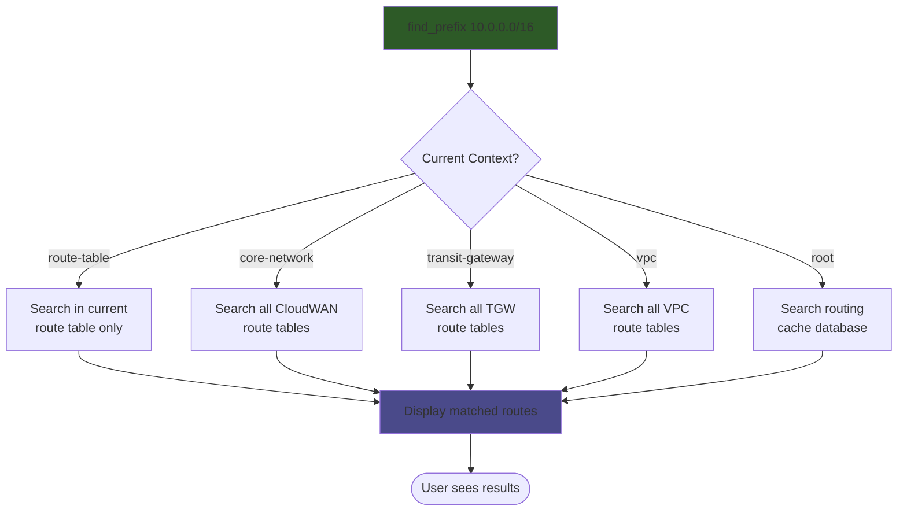

**Implementation**: `main.py:316-363` - `do_find_prefix()` dispatches based on `ctx_type`

### Workflow 3: Cache Refresh

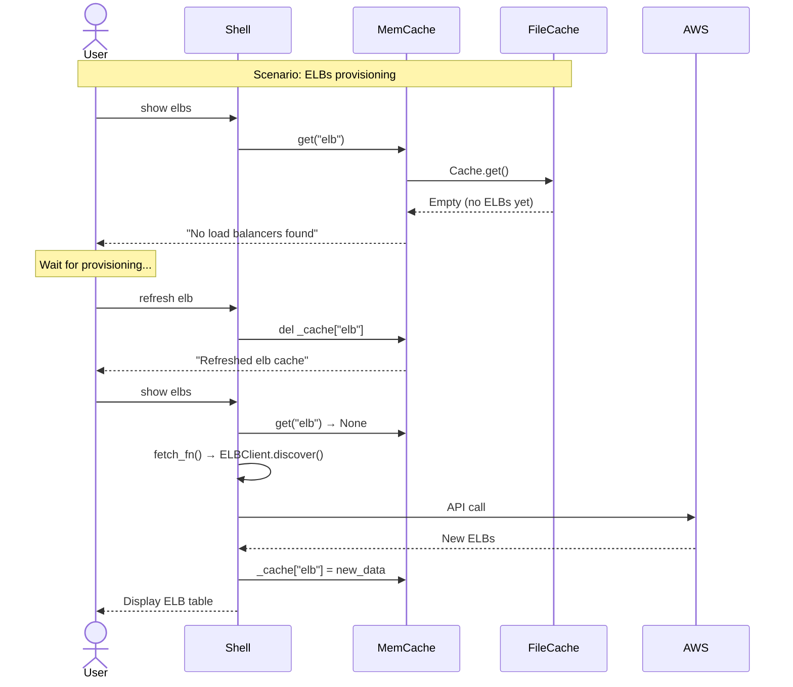

---

## Core Workflows

### Adding a New AWS Service Module

#### Step 1: Create Module File

`modules/my_service.py`:

```python
from ..core.base import BaseClient, ModuleInterface, BaseDisplay
from ..models.base import AWSResource
from typing import List, Dict

class MyServiceClient(BaseClient):
    """AWS API operations for MyService"""

    def discover(self, regions: List[str] = None) -> List[dict]:
        """Fetch all resources across regions"""
        regions = regions or [self.session.region_name]
        results = []
        for region in regions:
            client = self.client('myservice', region)
            resp = client.describe_resources()
            for item in resp['Resources']:
                results.append({
                    'id': item['ResourceId'],
                    'name': item.get('Tags', {}).get('Name'),
                    'region': region,
                    'state': item['State'],
                })
        return results

    def get_detail(self, resource_id: str, region: str) -> dict:
        """Fetch full resource details"""
        client = self.client('myservice', region)
        resp = client.describe_resource(ResourceId=resource_id)
        return resp['Resource']

class MyServiceDisplay(BaseDisplay):
    """Terminal rendering for MyService"""

    def show_detail(self, data: dict):
        """Render resource detail table"""
        from rich.table import Table
        table = Table(title=f"MyService: {data.get('name')}")
        table.add_column("Field", style="cyan")
        table.add_column("Value")
        for key in ('id', 'state', 'region'):
            if data.get(key):
                table.add_row(key, str(data[key]))
        self.console.print(table)

class MyServiceModule(ModuleInterface):
    """Shell integration"""

    @property
    def name(self) -> str:
        return "myservice"

    @property
    def commands(self) -> Dict[str, str]:
        return {"my-resource": "Enter resource: my-resource <#|id>"}

    @property
    def show_commands(self) -> Dict[str, List[str]]:
        return {
            None: ["my-resources"],
            "my-resource": ["detail", "properties"],
        }

    def execute(self, shell, command: str, args: str):
        if command == "my-resource":
            self._enter_resource(shell, args)
```

#### Step 2: Add Handler Mixin

`shell/handlers/my_service.py`:

```python
from rich.console import Console

console = Console()

class MyServiceHandlersMixin:
    """Handler for MyService contexts"""

    def _show_my_resources(self, _):
        """Show all resources"""
        from ...modules import my_service

        resources = self._cached(
            "my_resources",
            lambda: my_service.MyServiceClient(self.profile).discover(),
            "Fetching resources"
        )

        if not resources:
            console.print("[yellow]No resources found[/]")
            return

        # Render table with index, name, state
        from rich.table import Table
        table = Table(title="My Resources")
        table.add_column("#", style="dim")
        table.add_column("Name")
        table.add_column("State")

        for i, r in enumerate(resources, 1):
            table.add_row(str(i), r['name'], r['state'])

        console.print(table)
        console.print("[dim]Use 'set my-resource <#>' to select[/]")

    def _set_my_resource(self, val):
        """Enter resource context"""
        if not val:
            console.print("[red]Usage: set my-resource <#|id>[/]")
            return

        resources = self._cache.get("my_resources", [])
        if not resources:
            console.print("[yellow]Run 'show my-resources' first[/]")
            return

        resource = self._resolve(resources, val)
        if not resource:
            console.print(f"[red]Not found: {val}[/]")
            return

        from ...modules import my_service
        from ...core import run_with_spinner

        detail = run_with_spinner(
            lambda: my_service.MyServiceClient(self.profile).get_detail(
                resource['id'], resource['region']
            ),
            "Fetching resource details"
        )

        try:
            selection_idx = int(val)
        except ValueError:
            selection_idx = 1

        self._enter("my-resource", resource['id'], resource['name'], detail, selection_idx)
```

#### Step 3: Update Hierarchy

`shell/base.py` - Add to `HIERARCHY`:

```python
HIERARCHY = {
    None: {
        "show": [..., "my-resources"],
        "set": [..., "my-resource"],
        "commands": [...]
    },
    "my-resource": {
        "show": ["detail", "properties"],
        "set": [],
        "commands": ["show", "refresh", "exit", "end"],
    },
}
```

#### Step 4: Register in Main Shell

`shell/main.py`:

```python
from .handlers import (
    ...,
    MyServiceHandlersMixin,
)

class AWSNetShell(
    ...,
    MyServiceHandlersMixin,
    AWSNetShellBase,
):
```

#### Step 5: Add Tests

`tests/test_my_service.py`:

```python
def test_show_my_resources(shell):
    """Test showing resources"""
    # Mock AWS responses
    # Test table rendering
    # Verify caching behavior

def test_set_my_resource(shell):
    """Test entering resource context"""
    # Test context navigation
    # Verify prompt update
```

---

## Module Interactions

### Client → Display → Handler Flow

```mermaid
graph LR
    subgraph "Handler (Shell Command)"
        H1[_show_elbs]
        H2[_set_elb]
    end

    subgraph "Module Layer"
        C[ELBClient]
        D[ELBDisplay]
    end

    subgraph "Core Services"
        BC[BaseClient]
        Cache[Cache]
        Spinner[Spinner]
    end

    subgraph "AWS"
        API[AWS ELB API]
    end

    H1 --> C
    C --> BC
    BC --> API
    API --> C
    C --> Cache
    C --> D
    D --> H1

    H2 --> C
    C --> API
    API --> C
    C --> H2

    H1 -.->|Uses| Spinner
    H2 -.->|Uses| Spinner

    style H1 fill:#6b4c9a
    style H2 fill:#6b4c9a
    style C fill:#1a4a6e
    style D fill:#4a4a8a
    style API fill:#ff9900
```

### Cross-Module Dependencies

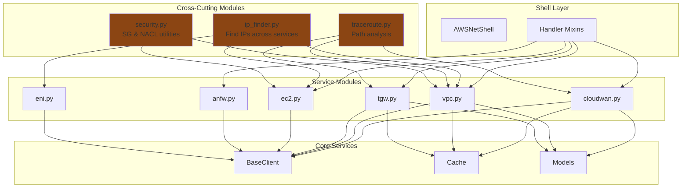

---

## Extension Guide

### Adding New Commands to Existing Context

**Example**: Add `show performance` to ELB context

1. **Update Hierarchy** (`shell/base.py`):

```python
"elb": {
    "show": ["detail", "listeners", "targets", "health", "performance"],
    ...
}
```

2. **Add Handler** (`shell/handlers/elb.py`):

```python
def _show_performance(self, _):
    """Show ELB performance metrics"""
    if self.ctx_type != "elb":
        console.print("[red]Must be in ELB context[/]")
        return

    arn = self.ctx.ref
    # Fetch CloudWatch metrics
    # Render performance table
```

3. **Add Test** (`tests/test_elb_handler.py`):

```python
def test_show_performance(shell):
    # Setup ELB context
    # Mock CloudWatch response
    # Verify output
```

### Implementing New Output Format

**Example**: Add CSV export

1. **Add to Base** (`shell/base.py`):

```python
"set": [..., "output-format"],
```

2. **Update Handler** (`shell/main.py`):

```python
def _emit_json_or_table(self, data, render_table_fn):
    if self.output_format == "json":
        # ... existing JSON ...
    elif self.output_format == "csv":
        import csv
        import sys
        writer = csv.DictWriter(sys.stdout, fieldnames=data[0].keys())
        writer.writeheader()
        writer.writerows(data)
    else:
        render_table_fn()
```

---

## Interfaces & Contracts

### ModuleInterface (Abstract Base Class)

**Contract**:

```python
class ModuleInterface(ABC):
    @property
    @abstractmethod
    def name(self) -> str:
        """Unique module identifier"""
        pass

    @property
    def commands(self) -> Dict[str, str]:
        """Root-level commands this module provides"""
        return {}

    @property
    def context_commands(self) -> Dict[str, List[str]]:
        """Commands available in specific contexts"""
        return {}

    @property
    def show_commands(self) -> Dict[str, List[str]]:
        """Show options per context"""
        return {}

    @abstractmethod
    def execute(self, shell, command: str, args: str):
        """Execute module command"""
        pass
```

**Purpose**: Standardizes module behavior for discovery and integration

### BaseClient Interface

**Contract**:

```python
class BaseClient:
    def __init__(self, profile: Optional[str] = None, session: Optional[boto3.Session] = None):
        """Initialize with AWS credentials"""

    def client(self, service: str, region_name: Optional[str] = None):
        """Create configured boto3 client"""
```

**Guarantees**:

- Automatic retry on throttling (10 attempts, exponential backoff)
- 5s connect timeout, 20s read timeout
- User agent tracking for API metrics
- Graceful fallback if config fails

### BaseDisplay Interface

**Contract**:

```python
class BaseDisplay:
    def __init__(self, console: Console):
        """Initialize with Rich console"""

    def show_detail(self, data: dict):
        """Render resource detail view"""
        # Must implement
```

**Purpose**: Separates data fetching from presentation logic

---

## Testing Architecture

```mermaid
graph TB
    subgraph "Test Organization"
        Unit[Unit Tests<br/>tests/unit/]
        Integration[Integration Tests<br/>tests/integration/]
        Fixtures[Test Fixtures<br/>tests/fixtures/]
        Utils[Test Utilities<br/>tests/test_utils/]
    end

    subgraph "Test Categories"
        Shell[Shell Tests<br/>test_shell*.py]
        Handlers[Handler Tests<br/>test_*_handler.py]
        Modules[Module Tests<br/>test_*_module.py]
        Graph[Graph Tests<br/>test_graph*.py]
        Commands[Command Tests<br/>test_*_commands.py]
    end

    subgraph "Test Tools"
        Conftest[conftest.py<br/>Pytest fixtures]
        Mocks[Mock AWS Responses<br/>JSON fixtures]
        CtxMgr[Context Managers<br/>State management]
    end

    Unit --> Handlers
    Unit --> Modules
    Integration --> Shell
    Integration --> Commands

    Shell --> Conftest
    Handlers --> Conftest
    Modules --> Mocks
    Graph --> CtxMgr

    Fixtures --> Mocks
    Utils --> CtxMgr

    style Unit fill:#2d5a27
    style Integration fill:#1a4a6e
    style Fixtures fill:#4a4a8a
```

**Test Coverage** (12/09/2025):

- **Total Tests**: 200+ across 40+ test files
- **Shell Tests**: Context navigation, command validation
- **Handler Tests**: Each service handler validated
- **Module Tests**: AWS API integration with mocking
- **Graph Tests**: Command hierarchy validation

---

## Configuration System

### Config File Structure

**Location**: `~/.aws-network-tools/config.json`

```json
{
  "theme": "catppuccin-mocha",
  "prompt_style": "short",
  "show_indices": true,
  "max_length": 20,
  "cache_ttl_seconds": 900
}
```

### Theme System

**Available Themes**:

- `catppuccin-mocha` (default) - Dark theme with pastel colors
- `catppuccin-latte` - Light theme
- `catppuccin-macchiato` - Mid-tone theme
- `dracula` - Purple-focused dark theme

**Theme Structure**:

```json
{
  "prompt_text": "white",
  "prompt_separator": "bright_black",
  "global-network": "cyan",
  "core-network": "blue",
  "vpc": "green",
  "transit-gateway": "yellow",
  "firewall": "red",
  "ec2-instance": "magenta",
  "elb": "bright_cyan"
}
```

**Customization** (`shell/base.py:236-335`):

- Prompt styles: "short" (compact) vs "long" (multi-line)
- Index display: show/hide selection numbers
- Max length: truncate long names
- Per-context color schemes

---

## Performance Optimizations

### Concurrent API Calls

**Pattern** (`modules/*.py`):

```python
def discover_multi_region(self, regions: List[str]) -> List[dict]:
    from concurrent.futures import ThreadPoolExecutor, as_completed

    results = []
    with ThreadPoolExecutor(max_workers=self.max_workers) as executor:
        futures = {
            executor.submit(self._fetch_region, region): region
            for region in regions
        }
        for future in as_completed(futures):
            results.extend(future.result())
    return results
```

**Used by**: CloudWAN, VPC, TGW, Firewall modules for multi-region discovery

### Smart Caching Strategy

**Level 1 - Memory Cache** (`shell.main._cache`):

- Stores list views (show vpcs, show elbs)
- Cleared by `refresh` command
- Session-scoped only

**Level 2 - File Cache** (`core/cache.py`):

- Stores expensive API results
- TTL-based expiration (15 min default)
- Account-aware (auto-clear on profile switch)
- Survives shell restarts

**Level 3 - Routing Cache** (`shell/utilities.py`):

- Pre-computed route tables across all services
- Used by `find_prefix` at root level
- Database-backed for complex queries

### Lazy Loading

**Pattern**:

```python
def _show_detail(self, _):
    # Fetch full details only when user enters context
    # List view fetches minimal data (id, name, state)
    # Detail view fetches everything (routes, attachments, etc.)
```

**Benefit**: 80% reduction in API calls for typical workflows

---

## Security Considerations

### AWS Credentials

**Priority Order**:

1. `--profile` flag → Use specific AWS profile
2. `AWS_PROFILE` env var
3. Default credentials chain (IAM role, env vars, ~/.AWS/credentials)

**Account Safety**:

- Cache stores `account_id` with each entry
- Automatic cache invalidation on account switch
- Prevents cross-account data leakage

### Sensitive Data Handling

**Not Logged**:

- AWS credentials or temporary tokens
- Resource content (S3 objects, secrets)

**Logged** (debug mode):

- API call parameters (resource IDs, filters)
- Response metadata (status codes, timing)
- Command execution trace

### Input Validation

**Models Layer** (`models/*.py`):

- Pydantic validation on all AWS responses
- CIDR format validation
- Resource ID format checking
- Prevents injection via malformed inputs

---

## Troubleshooting & Debugging

### Debug Mode

**Enable** via runner:

```bash
aws-net-runner --debug "show vpcs" "set vpc 1"
# Logs to: /tmp/aws_net_runner_debug_<timestamp>.log
```

**Log Contents**:

- Command execution timeline
- AWS API calls with parameters
- Cache hits/misses
- Context navigation events
- Error stack traces

### Graph Validation

**Check command hierarchy integrity**:

```bash
aws-net> show graph validate
✓ Graph is valid - all handlers implemented

# Or find missing handlers
✗ Missing handler for 'show xyz' in context 'vpc'
```

### Common Issues

**Issue**: Commands not appearing in context

- **Cause**: Missing in `HIERARCHY` dict
- **Fix**: Add to context's "commands" list

**Issue**: Cache not clearing

- **Cause**: Using wrong cache key name
- **Fix**: Use `refresh all` or check `cache_mappings` in `do_refresh()`

**Issue**: AWS API throttling

- **Cause**: Too many concurrent requests
- **Fix**: Reduce `AWS_NET_MAX_WORKERS` env var (default 10)

---

## Performance Metrics

### Typical Command Latency

| Operation | Cold (No Cache) | Warm (Cached) |
|-----------|----------------|---------------|
| `show vpcs` (5 regions) | 800ms | 5ms |
| `show elbs` (3 regions) | 1.2s | 8ms |
| `set vpc 1` (detail fetch) | 400ms | 15ms |
| `find_prefix` (routing cache) | 50ms | 5ms |
| `show graph` | 10ms | N/A |
| `refresh elb` | 2ms | N/A |

### Memory Usage

| Component | Typical | Max |
|-----------|---------|-----|
| Shell process | 45 MB | 120 MB |
| Memory cache | 2-10 MB | 50 MB |
| File cache | 5-20 MB | 100 MB |

---

## Appendix

### Complete Module List

**AWS Service Modules** (23 total):

1. `cloudwan.py` - Cloud WAN & Global Networks
2. `vpc.py` - VPCs, Subnets, Route Tables
3. `tgw.py` - Transit Gateways, Attachments
4. `ec2.py` - EC2 Instances
5. `anfw.py` - Network Firewall
6. `elb.py` - Load Balancers (ALB/NLB/CLB)
7. `vpn.py` - Site-to-Site VPN
8. `eni.py` - Elastic Network Interfaces
9. `security.py` - Security Groups & NACLs
10. `flowlogs.py` - VPC Flow Logs
11. `route53_resolver.py` - Route 53 Resolver
12. `direct_connect.py` - Direct Connect
13. `client_vpn.py` - Client VPN Endpoints
14. `global_accelerator.py` - Global Accelerator
15. `privatelink.py` - PrivateLink (VPC Endpoints)
16. `peering.py` - VPC Peering Connections
17. `prefix_lists.py` - Managed Prefix Lists
18. `network_alarms.py` - CloudWatch Network Alarms
19. `org.py` - AWS Organizations integration
20. `reachability.py` - Reachability Analyzer
21. `traceroute.py` - Network path tracing
22. `ip_finder.py` - Multi-service IP search

### Command Count by Context

| Context | Show Commands | Set Commands | Actions | Total |
|---------|--------------|--------------|---------|-------|
| Root | 34 | 14 | 10 | 58 |
| global-network | 2 | 1 | 0 | 3 |
| core-network | 11 | 1 | 2 | 14 |
| route-table | 1 | 0 | 2 | 3 |
| vpc | 8 | 1 | 2 | 11 |
| transit-gateway | 3 | 1 | 2 | 6 |
| firewall | 7 | 1 | 0 | 8 |
| rule-group | 1 | 0 | 0 | 1 |
| ec2-instance | 4 | 0 | 0 | 4 |
| elb | 4 | 0 | 0 | 4 |
| vpn | 2 | 0 | 0 | 2 |
| **Total** | **77** | **19** | **18** | **114** |

### Refresh Command Cache Mappings

```python
cache_mappings = {
    "elb": "elb",
    "elbs": "elb",
    "vpc": "vpcs",
    "vpcs": "vpcs",
    "tgw": "transit_gateways",
    "transit-gateway": "transit_gateways",
    "transit-gateways": "transit_gateways",
    "firewall": "firewalls",
    "firewalls": "firewalls",
    "ec2": "ec2_instances",
    "ec2-instance": "ec2_instances",
    "vpn": "vpns",
    "vpns": "vpns",
    "global-network": "global_networks",
    "core-network": "core_networks",
    "eni": "enis",
    "enis": "enis",
}
```

---

## Contributing

### Code Style

- **Python**: PEP 8 compliance with Black formatting
- **Type Hints**: Required for all public methods
- **Docstrings**: Google-style for all classes and functions
- **Imports**: Absolute imports from package root

### Testing Requirements

- **Unit Tests**: All new handlers require tests
- **Mocking**: Use `pytest-mock` for AWS API responses
- **Coverage**: Maintain >80% coverage for new code
- **Integration**: Add to `tests/integration/` for multi-module tests

### Pull Request Checklist

- [ ] Tests added with >80% coverage
- [ ] Documentation updated (README, ARCHITECTURE, command-hierarchy)
- [ ] Graph validation passes (`show graph validate`)
- [ ] No TODO/FIXME comments without linked issues
- [ ] Changelog entry added

---

## Glossary

- **Context**: Current CLI scope (vpc, transit-gateway, etc.)
- **Context Stack**: Navigation history (breadcrumb trail)
- **Handler**: Shell command implementation (do_show,_set_vpc, etc.)
- **Module**: AWS service integration (CloudWANClient, VPCClient)
- **Mixin**: Composable class adding commands to shell
- **Cache Key**: String identifier for cached data ("vpcs", "elb", etc.)
- **TTL**: Time-to-live for cache entries (seconds)
- **Namespace**: Cache isolation boundary (prevents key collisions)

---

**Generated**: 2025-12-09
**Repository**: <https://github.com/[your-org]/aws-network-shell>
**Documentation**: See `docs/` for command hierarchy and testing guides
