# AWS Network Tools - Command Hierarchy & Entity Relationships

## Overview

This document shows the complete command hierarchy with clear entity relationships and context navigation.

- **Total Nodes**: 104
- **Command Paths**: 98
- **Contexts**: 11
- **Implemented Commands**: 103

## Entity Relationship Diagram

```mermaid
graph TD
    classDef root fill:#2d5a27,stroke:#1a3518,color:#fff
    classDef context fill:#1a4a6e,stroke:#0d2840,color:#fff
    classDef show fill:#4a4a8a,stroke:#2d2d5a,color:#fff
    classDef set fill:#6b4c9a,stroke:#3d2a5a,color:#fff
    classDef action fill:#8b4513,stroke:#5a2d0a,color:#fff
    classDef unimpl fill:#666,stroke:#333,color:#fff,stroke-dasharray: 5 5

    %% Root Context
    root["aws-net"]:::root

    root_set_global_network{"set global-network → global-network"}:::context
    root --> root_set_global_network

    subgraph sub_global_network["global-network context"]
        global_network_show_detail["show detail"]:::show
        root_set_global_network --> global_network_show_detail
        global_network_show_core_networks["show core-networks"]:::show
        root_set_global_network --> global_network_show_core_networks
    end

    global_network_set_core_network{"set core-network → core-network"}:::context
    root --> global_network_set_core_network
    core_network_set_route_table{"set route-table → route-table"}:::context
    root --> core_network_set_route_table

    subgraph sub_route_table["route-table context"]
        route_table_show_routes["show routes"]:::show
        core_network_set_route_table --> route_table_show_routes
        route_table_do_find_prefix(("find_prefix")):::action
        core_network_set_route_table --> route_table_do_find_prefix
        route_table_do_find_null_routes(("find_null_routes")):::action
        core_network_set_route_table --> route_table_do_find_null_routes
    end

    root_set_vpc{"set vpc → vpc"}:::context
    root --> root_set_vpc
    root_set_transit_gateway{"set transit-gateway → transit-gateway"}:::context
    root --> root_set_transit_gateway

    subgraph sub_transit_gateway["transit-gateway context"]
        transit_gateway_show_detail["show detail"]:::show
        root_set_transit_gateway --> transit_gateway_show_detail
        transit_gateway_show_route_tables["show route-tables"]:::show
        root_set_transit_gateway --> transit_gateway_show_route_tables
        transit_gateway_show_attachments["show attachments"]:::show
        root_set_transit_gateway --> transit_gateway_show_attachments
        transit_gateway_do_find_prefix(("find_prefix")):::action
        root_set_transit_gateway --> transit_gateway_do_find_prefix
        transit_gateway_do_find_null_routes(("find_null_routes")):::action
        root_set_transit_gateway --> transit_gateway_do_find_null_routes
    end

    root_set_firewall{"set firewall → firewall"}:::context
    root --> root_set_firewall
    root_set_ec2_instance{"set ec2-instance → ec2-instance"}:::context
    root --> root_set_ec2_instance

    subgraph sub_ec2_instance["ec2-instance context"]
        ec2_instance_show_detail["show detail"]:::show
        root_set_ec2_instance --> ec2_instance_show_detail
        ec2_instance_show_security_groups["show security-groups"]:::show
        root_set_ec2_instance --> ec2_instance_show_security_groups
        ec2_instance_show_enis["show enis"]:::show
        root_set_ec2_instance --> ec2_instance_show_enis
        ec2_instance_show_routes["show routes"]:::show
        root_set_ec2_instance --> ec2_instance_show_routes
    end

    root_set_elb{"set elb → elb"}:::context
    root --> root_set_elb
    root_set_vpn{"set vpn → vpn"}:::context
    root --> root_set_vpn

    subgraph sub_vpn["vpn context"]
        vpn_show_detail["show detail"]:::show
        root_set_vpn --> vpn_show_detail
        vpn_show_tunnels["show tunnels"]:::show
        root_set_vpn --> vpn_show_tunnels
    end

    %% Root-level Commands
    root_show_version["show version"]:::show
    root --> root_show_version
    root_show_global_networks["show global-networks"]:::show
    root --> root_show_global_networks
    root_show_vpcs["show vpcs"]:::show
    root --> root_show_vpcs
    root_show_transit_gateways["show transit_gateways"]:::show
    root --> root_show_transit_gateways
    root_show_firewalls["show firewalls"]:::show
    root --> root_show_firewalls
    root_show_dx_connections["show dx-connections"]:::show
    root --> root_show_dx_connections
    root_show_enis["show enis"]:::show
    root --> root_show_enis
    root_show_bgp_neighbors["show bgp-neighbors"]:::show
    root --> root_show_bgp_neighbors
```

## Detailed Hierarchy by Context

### Root Context (Top Level)

Commands available immediately after starting the shell:

- ✓ show version
- ✓ show global-networks
- ✓ show vpcs
- ✓ show transit_gateways
- ✓ show firewalls
- ✓ show dx-connections
- ✓ show enis
- ✓ show bgp-neighbors
- ✓ show ec2-instances
- ✓ show elbs
- ✓ show vpns
- ✓ show security-groups
- ✓ show unused-sgs
- ✓ show resolver-endpoints
- ✓ show resolver-rules
- ✓ show query-logs
- ✓ show peering-connections
- ✓ show prefix-lists
- ✓ show network-alarms
- ✓ show alarms-critical
- ✓ show client-vpn-endpoints
- ✓ show global-accelerators
- ✓ show ga-endpoint-health
- ✓ show endpoint-services
- ✓ show vpc-endpoints
- ✓ show config
- ✓ show running-config
- ✓ show cache
- ✓ show routing-cache
- ✓ show graph
- ✓ set profile
- ✓ set regions
- ✓ set no-cache
- ✓ set output-format
- ✓ set output-file
- ✓ set watch
- ✓ write
- ✓ trace
- ✓ find_ip
- ✓ find_prefix
- ✓ find_null_routes
- ✓ reachability
- ✓ populate_cache
- ✓ clear_cache
- ✓ create_routing_cache
- ✓ validate_graph
- ✓ export_graph

### Global Network Context

**Entry Command**: ✓ `set global-network` → enters `global-network` context

**Show Commands**:
  - ✓ `show core-networks`
  - ✓ `show detail`

### Core Network Context

**Entry Command**: ✓ `set core-network` → enters `core-network` context

**Show Commands**:
  - ✓ `show blackhole-routes`
  - ✓ `show connect-attachments`
  - ✓ `show connect-peers`
  - ✓ `show detail`
  - ✓ `show policy`
  - ✓ `show policy-change-events`
  - ✓ `show rib`
  - ✓ `show route-tables`
  - ✓ `show routes`
  - ✓ `show segments`

**Action Commands**:
  - ✓ `find_null_routes`
  - ✓ `find_prefix`

### Route Table Context

**Entry Command**: ✓ `set route-table` → enters `route-table` context

**Show Commands**:
  - ✓ `show routes`

**Action Commands**:
  - ✓ `find_null_routes`
  - ✓ `find_prefix`

### Vpc Context

**Entry Command**: ✓ `set vpc` → enters `vpc` context

**Show Commands**:
  - ✓ `show detail`
  - ✓ `show endpoints`
  - ✓ `show internet-gateways`
  - ✓ `show nacls`
  - ✓ `show nat-gateways`
  - ✓ `show route-tables`
  - ✓ `show security-groups`
  - ✓ `show subnets`

**Action Commands**:
  - ✓ `find_null_routes`
  - ✓ `find_prefix`

### Transit Gateway Context

**Entry Command**: ✓ `set transit-gateway` → enters `transit-gateway` context

**Show Commands**:
  - ✓ `show attachments`
  - ✓ `show detail`
  - ✓ `show route-tables`

**Action Commands**:
  - ✓ `find_null_routes`
  - ✓ `find_prefix`

### Firewall Context

**Entry Command**: ✓ `set firewall` → enters `firewall` context

**Show Commands**:
  - ✓ `show detail`
  - ✓ `show policy`
  - ✓ `show rule-groups`

### Ec2 Instance Context

**Entry Command**: ✓ `set ec2-instance` → enters `ec2-instance` context

**Show Commands**:
  - ✓ `show detail`
  - ✓ `show enis`
  - ✓ `show routes`
  - ✓ `show security-groups`

### Elb Context

**Entry Command**: ✓ `set elb` → enters `elb` context

**Show Commands**:
  - ✓ `show detail`
  - ✓ `show health`
  - ✓ `show listeners`
  - ✓ `show targets`

### Vpn Context

**Entry Command**: ✓ `set vpn` → enters `vpn` context

**Show Commands**:
  - ✓ `show detail`
  - ✓ `show tunnels`

## Entity Relationships

The table below shows how commands navigate between contexts:

| From Context | Command | To Context | Relationship Type |
|--------------|---------|------------|-------------------|
| `root` | `set global-network` | `global-network` | **Enters Context** |
| `global-network` | `set core-network` | `core-network` | **Enters Context** |
| `core-network` | `set route-table` | `route-table` | **Enters Context** |
| `root` | `set vpc` | `vpc` | **Enters Context** |
| `vpc` | `set route-table` | `route-table` | **Enters Context** |
| `root` | `set transit-gateway` | `transit-gateway` | **Enters Context** |
| `transit-gateway` | `set route-table` | `route-table` | **Enters Context** |
| `root` | `set firewall` | `firewall` | **Enters Context** |
| `root` | `set ec2-instance` | `ec2-instance` | **Enters Context** |
| `root` | `set elb` | `elb` | **Enters Context** |
| `root` | `set vpn` | `vpn` | **Enters Context** |

## Complete Command Paths

All possible command sequences from root to leaves:

1. `clear_cache`
2. `create_routing_cache`
3. `export_graph`
4. `find_ip`
5. `find_null_routes`
6. `find_prefix`
7. `populate_cache`
8. `reachability`
9. `set ec2-instance → show detail`
10. `set ec2-instance → show enis`
11. `set ec2-instance → show routes`
12. `set ec2-instance → show security-groups`
13. `set elb → show detail`
14. `set elb → show health`
15. `set elb → show listeners`
16. `set elb → show targets`
17. `set firewall → show detail`
18. `set firewall → show policy`
19. `set firewall → show rule-groups`
20. `set global-network → set core-network → find_null_routes`
21. `set global-network → set core-network → find_prefix`
22. `set global-network → set core-network → set route-table → find_null_routes`
23. `set global-network → set core-network → set route-table → find_prefix`
24. `set global-network → set core-network → set route-table → show routes`
25. `set global-network → set core-network → show blackhole-routes`
26. `set global-network → set core-network → show connect-attachments`
27. `set global-network → set core-network → show connect-peers`
28. `set global-network → set core-network → show detail`
29. `set global-network → set core-network → show policy`
30. `set global-network → set core-network → show policy-change-events`
31. `set global-network → set core-network → show rib`
32. `set global-network → set core-network → show route-tables`
33. `set global-network → set core-network → show routes`
34. `set global-network → set core-network → show segments`
35. `set global-network → show core-networks`
36. `set global-network → show detail`
37. `set no-cache`
38. `set output-file`
39. `set output-format`
40. `set profile`
41. `set regions`
42. `set transit-gateway → find_null_routes`
43. `set transit-gateway → find_prefix`
44. `set transit-gateway → set route-table → find_null_routes`
45. `set transit-gateway → set route-table → find_prefix`
46. `set transit-gateway → set route-table → show routes`
47. `set transit-gateway → show attachments`
48. `set transit-gateway → show detail`
49. `set transit-gateway → show route-tables`
50. `set vpc → find_null_routes`
51. `set vpc → find_prefix`
52. `set vpc → set route-table → find_null_routes`
53. `set vpc → set route-table → find_prefix`
54. `set vpc → set route-table → show routes`
55. `set vpc → show detail`
56. `set vpc → show endpoints`
57. `set vpc → show internet-gateways`
58. `set vpc → show nacls`
59. `set vpc → show nat-gateways`
60. `set vpc → show route-tables`
61. `set vpc → show security-groups`
62. `set vpc → show subnets`
63. `set vpn → show detail`
64. `set vpn → show tunnels`
65. `set watch`
66. `show alarms-critical`
67. `show bgp-neighbors`
68. `show cache`
69. `show client-vpn-endpoints`
70. `show config`
71. `show dx-connections`
72. `show ec2-instances`
73. `show elbs`
74. `show endpoint-services`
75. `show enis`
76. `show firewalls`
77. `show ga-endpoint-health`
78. `show global-accelerators`
79. `show global-networks`
80. `show graph`
81. `show network-alarms`
82. `show peering-connections`
83. `show prefix-lists`
84. `show query-logs`
85. `show resolver-endpoints`
86. `show resolver-rules`
87. `show routing-cache`
88. `show running-config`
89. `show security-groups`
90. `show transit_gateways`
91. `show unused-sgs`
92. `show version`
93. `show vpc-endpoints`
94. `show vpcs`
95. `show vpns`
96. `trace`
97. `validate_graph`
98. `write`

## Statistics

- **Total Contexts**: 9
- **Total Nodes**: 104
- **Implemented**: 103 commands
- **Command Paths**: 98

## Implementation Status

- ✓ = Command is implemented
- ○ = Command is defined but not yet implemented
- Commands marked with **Enters Context** navigate to a new context
