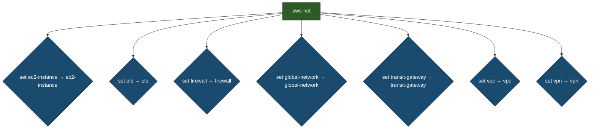
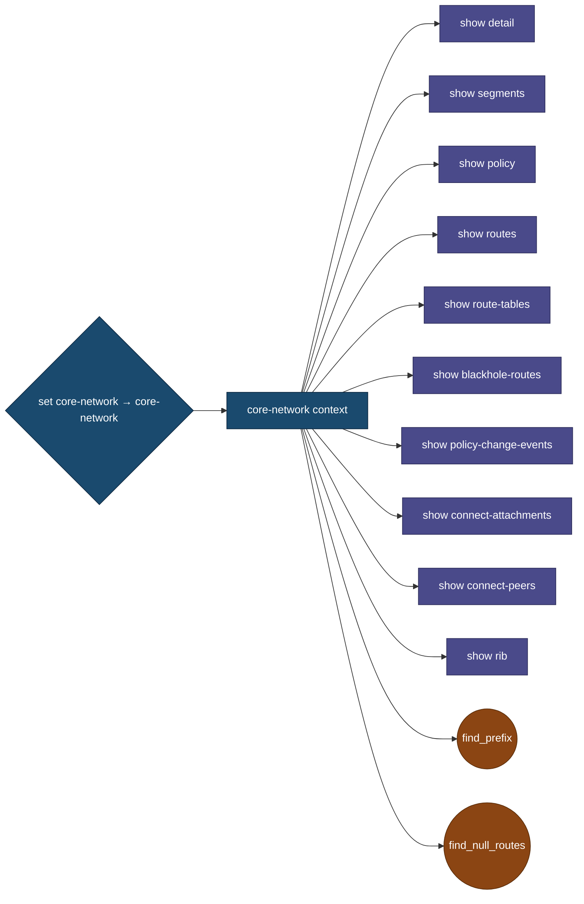
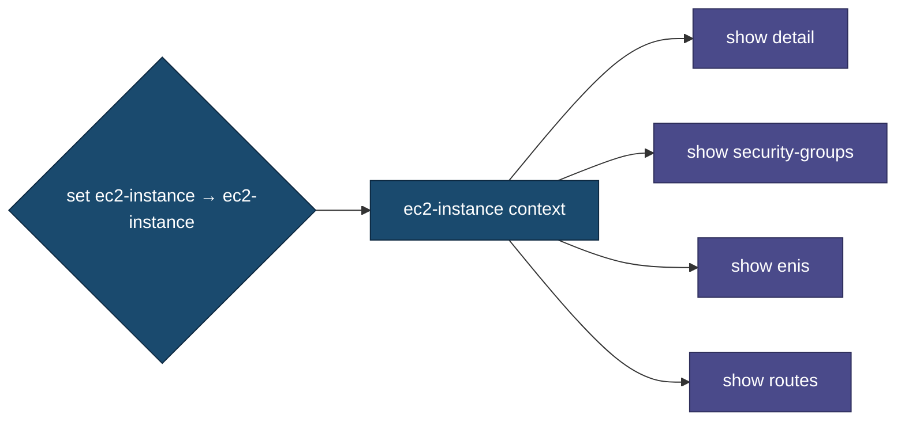
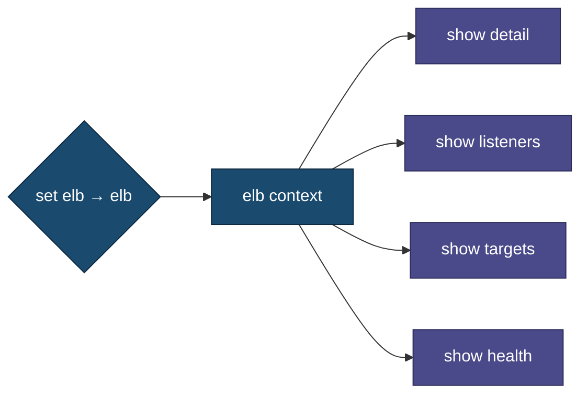
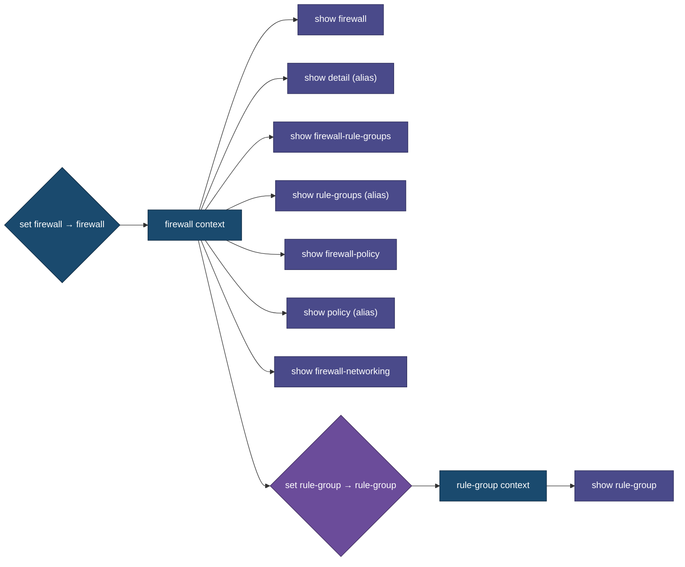
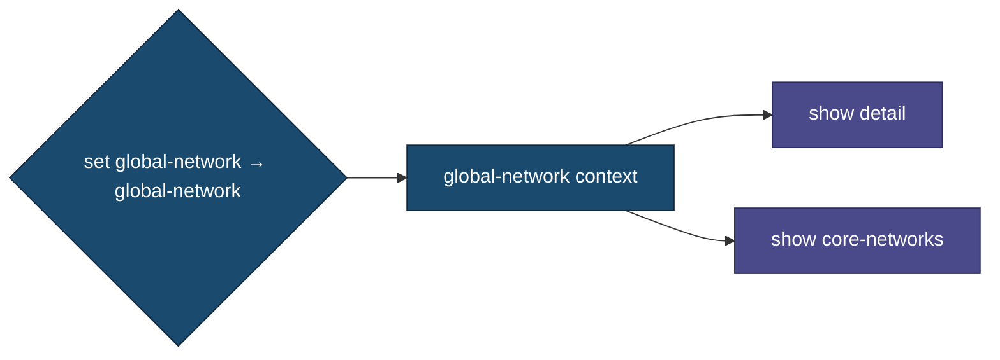
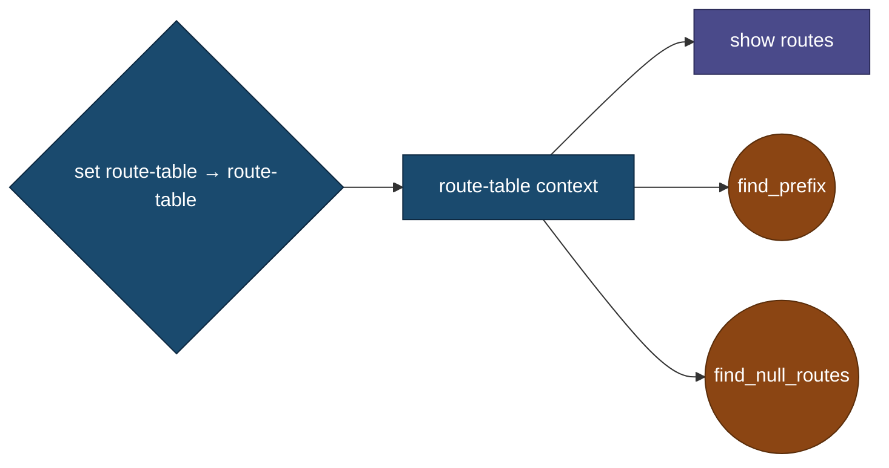
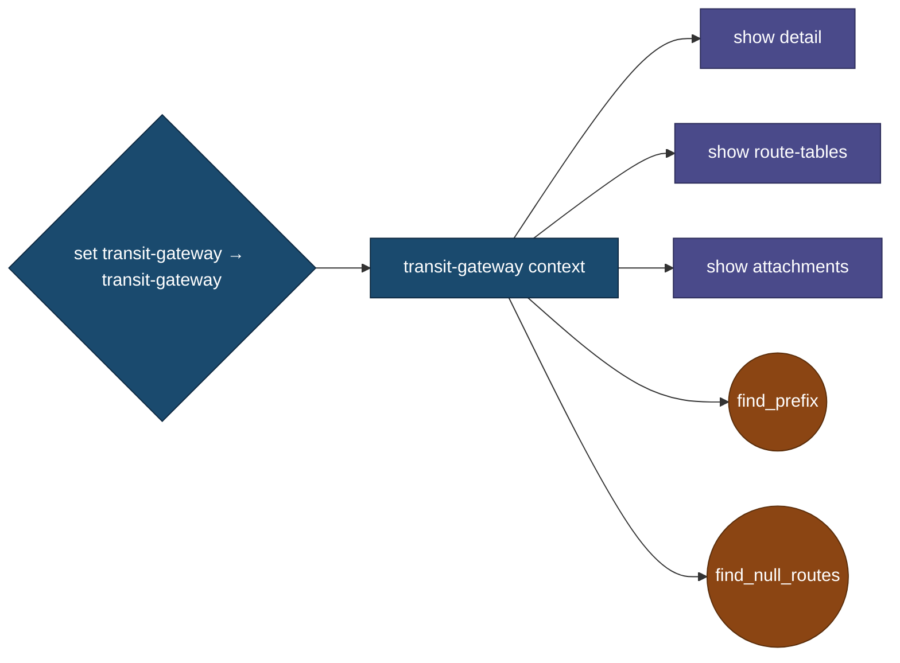
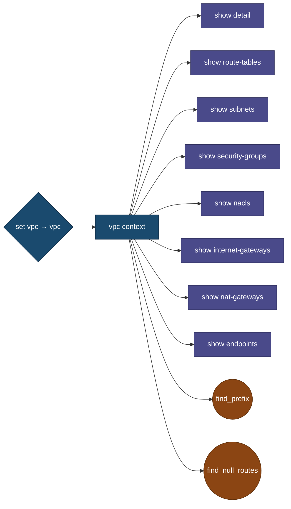
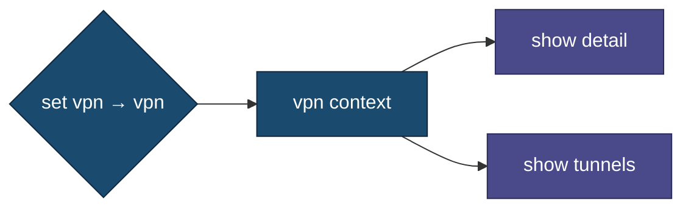

# AWS Network Tools - Command Hierarchy (Split Diagrams)

This document shows the command hierarchy using multiple smaller, readable diagrams.

- **Total Contexts**: 9
- **Total Commands**: 103

## Commands Overview

### Cache Management
- `clear_cache` - Clear all cached data (permanent)
- `refresh [target|all]` - Refresh specific or all cached data
  - `refresh` - Refresh current context data
  - `refresh elb` - Clear ELB cache and re-fetch on next show
  - `refresh all` - Clear all caches
  - Available in all contexts for immediate cache invalidation

### Navigation
- `exit` - Go back one context level
- `end` - Return to root level
- `clear` - Clear the screen

### Resource Discovery
- `find_ip <ip-address>` - Locate IP address across AWS resources
- `find_prefix <cidr>` - Find routes matching CIDR prefix
- `find_null_routes` - Show blackhole routes

## 1. Overview: Context Navigation

## 2. Core-Network Context

**Entry**: `set core-network`

## 3. Ec2-Instance Context

**Entry**: `set ec2-instance`

## 4. Elb Context

**Entry**: `set elb`

## 5. Firewall Context

**Entry**: `set firewall`

## 6. Global-Network Context

**Entry**: `set global-network`

## 7. Route-Table Context

**Entry**: `set route-table`

## 8. Transit-Gateway Context

**Entry**: `set transit-gateway`

## 9. Vpc Context

**Entry**: `set vpc`

## 10. Vpn Context

**Entry**: `set vpn`

