# Scripts Directory

This directory contains automation tools for testing, debugging, and investigating issues in `aws-net-shell`.

## Overview

```
scripts/
├── issue_investigator.py   # 🔍 Interactive GitHub issue investigation
├── run_issue_tests.py      # 🧪 Automated issue regression testing
├── fetch_issues.py         # 📥 Fetch and parse GitHub issues
├── shell_runner.py         # 🐚 Programmatic shell command execution
├── issue_tests.yaml        # 📋 Issue test definitions
└── s2svpn/                  # 🔧 Site-to-Site VPN utilities
```

---

## Issue Investigator

The `issue_investigator.py` tool provides an interactive workflow for investigating GitHub issues, reproducing bugs, and generating structured debug information for AI agents.

### Features

| Feature | Description |
|---------|-------------|
| 🎯 Interactive Selection | Browse and select from open issues |
| 🔄 Auto-Reproduction | Extracts and runs commands from issue body |
| 🔍 Error Detection | Detects exceptions, KeyErrors, TypeErrors, etc. |
| 📊 Status Analysis | Determines if issue is confirmed, fixed, or partial |
| 🤖 Agent Prompts | Generates XML (default) or markdown for AI consumption |
| 💾 JSON Export | Saves full investigation data for tooling |

### Quick Start

```bash
# List all open issues
uv run python scripts/issue_investigator.py --list

# Interactive mode - select from table
uv run python scripts/issue_investigator.py

# Investigate specific issue
uv run python scripts/issue_investigator.py --issue 5

# With AWS profile
uv run python scripts/issue_investigator.py --profile my-profile --issue 3

# Generate agent prompt (XML - default, recommended for AI agents)
uv run python scripts/issue_investigator.py --issue 5 --agent-prompt

# Generate agent prompt in markdown format
uv run python scripts/issue_investigator.py --issue 5 --agent-prompt --format markdown

# Full debug output to file
uv run python scripts/issue_investigator.py --issue 5 -v -o debug_report.json
```

### Investigation Workflow

```mermaid
flowchart TD
    A[Start] --> B{Issue specified?}
    B -->|No| C[Fetch open issues from GitHub]
    C --> D[Display issues table]
    D --> E[User selects issue]
    B -->|Yes| F[Fetch specific issue]
    E --> F
    F --> G[Extract commands from issue body]
    G --> H{Commands found?}
    H -->|No| I[Mark as 'no_commands'<br/>Recommend manual review]
    H -->|Yes| J[Extract expected errors]
    J --> K[Start aws-net-shell]
    K --> L[Run each command]
    L --> M[Capture output & timing]
    M --> N[Detect errors in output]
    N --> O{More commands?}
    O -->|Yes| L
    O -->|No| P[Compare actual vs expected errors]
    P --> Q{Errors match?}
    Q -->|Yes| R[Status: CONFIRMED ❌]
    Q -->|No errors found| S[Status: NOT REPRODUCIBLE ✅]
    Q -->|Different errors| T[Status: PARTIAL ⚠️]
    R --> U[Generate recommendations]
    S --> U
    T --> U
    I --> U
    U --> V[Display results]
    V --> W{Output file?}
    W -->|Yes| X[Save JSON report]
    W -->|No| Y[End]
    X --> Y
```



### Output Formats

#### Console Output

The tool displays a formatted summary with status indicators:

- ❌ **CONFIRMED** - Issue reproduced successfully
- ✅ **NOT REPRODUCIBLE** - Expected errors not found (may be fixed)
- ⚠️ **PARTIAL** - Some issues detected, manual review needed
- 💥 **ERROR** - Investigation itself failed
- 📝 **NO COMMANDS** - Issue body has no extractable commands

#### JSON Export (`--output`)

```json
{
  "investigation": {
    "issue_number": 5,
    "issue_title": "Can't set Transit Gateway Route Table",
    "issue_url": "https://github.com/...",
    "reproduced": true,
    "status": "confirmed",
    "commands_run": [...],
    "actual_errors": ["InvalidCommand: ..."],
    "recommendations": [...]
  },
  "agent_prompt": "# GitHub Issue #5: ..."
}
```

#### Agent Prompt (`--agent-prompt`)

Generates structured prompts for AI agents. **XML is the default** and recommended for agents due to:
- Clear, unambiguous delimiters
- Lower token overhead
- Easier programmatic parsing
- Better structure recognition by LLMs

**XML Format (default):**

```xml
<issue_investigation>
  <issue number="5">
    <title>Can't set Transit Gateway Route Table</title>
    <url>https://github.com/NetDevAutomate/aws_network_shell/issues/5</url>
    <status>confirmed</status>
    <reproduced>True</reproduced>
  </issue>
  <description>...</description>
  <commands_executed>
    <command index="1">
      <input>show transit_gateways</input>
      <output><![CDATA[...]]></output>
      <duration_seconds>2.34</duration_seconds>
    </command>
  </commands_executed>
  <errors_detected>
    <error>InvalidCommand: transit-gateways</error>
  </errors_detected>
  <task>
    <objective>Fix the confirmed issue</objective>
    <steps>
      <step>Analyze the error messages and stack traces</step>
      <step>Search the codebase for relevant code</step>
      <step>Identify the root cause</step>
      <step>Implement a fix</step>
      <step>Add a test case</step>
    </steps>
  </task>
  <recommendations>
    <recommendation>Invalid command - check command registration</recommendation>
  </recommendations>
</issue_investigation>
```

**Markdown Format** (`--format markdown`):

```markdown
# GitHub Issue #5: Can't set Transit Gateway Route Table

**URL:** https://github.com/...
**Status:** CONFIRMED
...
```

---

## Suggested Workflows

### Workflow 1: AI-Assisted Bug Fixing

Use the investigator to gather debug info, then pass to an AI agent for fixing.


**Commands:**

```bash
# Step 1: Investigate and save report
uv run python scripts/issue_investigator.py --issue 5 -v -o issue_5_debug.json

# Step 2: Generate agent prompt (copy to AI assistant)
uv run python scripts/issue_investigator.py --issue 5 --agent-prompt

# Step 3: After fix, verify with regression test
uv run python scripts/run_issue_tests.py --issue 5
```

### Workflow 2: Regression Testing Before Release

Run all issue tests to ensure no regressions.

```mermaid
flowchart LR
    A[Pull Request] --> B[Run Issue Tests]
    B --> C{All Pass?}
    C -->|Yes| D[✅ Merge PR]
    C -->|No| E[❌ Fix Regressions]
    E --> B
```



**Commands:**

```bash
# Run all issue tests
uv run python scripts/run_issue_tests.py

# Run with specific profile
uv run python scripts/run_issue_tests.py --profile prod-readonly
```

### Workflow 3: New Issue Triage

When a new issue is reported, quickly validate it.

```bash
# 1. Fetch and review the new issue
uv run python scripts/fetch_issues.py --issue 12 --format yaml

# 2. Investigate to confirm
uv run python scripts/issue_investigator.py --issue 12 -v

# 3. If confirmed, add to issue_tests.yaml for regression testing
```

---

## Other Scripts

### `shell_runner.py`

Programmatic interface to run commands against `aws-net-shell`.

```bash
# Run commands as arguments
uv run python scripts/shell_runner.py "show vpcs" "set vpc 1" "show subnets"

# Pipe commands from stdin
echo -e "show global-networks\nset global-network 3" | uv run python scripts/shell_runner.py

# With AWS profile
uv run python scripts/shell_runner.py --profile my-profile "show transit_gateways"
```

### `fetch_issues.py`

Fetch GitHub issues and extract commands.

```bash
# Fetch all open issues as YAML
uv run python scripts/fetch_issues.py

# Fetch specific issue
uv run python scripts/fetch_issues.py --issue 5

# Output as shell_runner commands
uv run python scripts/fetch_issues.py --issue 5 --format commands

# Output as JSON
uv run python scripts/fetch_issues.py --format json
```

### `run_issue_tests.py`

Run regression tests defined in `issue_tests.yaml`.

```bash
# Run all tests
uv run python scripts/run_issue_tests.py

# Run specific issue test
uv run python scripts/run_issue_tests.py --issue 5

# Print commands for manual testing
uv run python scripts/run_issue_tests.py --issue 5 --print-commands
```

### `issue_tests.yaml`

YAML file defining issue reproduction tests:

```yaml
issues:
  5:
    title: "Can't set Transit Gateway Route Table"
    commands:
      - show transit_gateways
      - set transit-gateway 1
      - show route-tables
      - set route-table 1
    expect_error: "Run 'show route-tables' first"
```

---

## Architecture

```mermaid
graph TB
    subgraph "GitHub"
        GH[GitHub API]
        Issues[(Issues)]
    end

    subgraph "Scripts"
        FI[fetch_issues.py]
        II[issue_investigator.py]
        RT[run_issue_tests.py]
        SR[shell_runner.py]
        YML[issue_tests.yaml]
    end

    subgraph "Shell"
        Shell[aws-net-shell]
        AWS[AWS APIs]
    end

    subgraph "Output"
        Console[Console Display]
        JSON[JSON Reports]
        Agent[Agent Prompts]
    end

    GH --> FI
    GH --> II
    FI --> YML
    YML --> RT
    II --> SR
    RT --> SR
    SR --> Shell
    Shell --> AWS
    II --> Console
    II --> JSON
    II --> Agent
    RT --> Console
```

---

## Environment Variables

| Variable | Description | Required |
|----------|-------------|----------|
| `GITHUB_TOKEN` | GitHub personal access token | No (for public repos) |
| `AWS_PROFILE` | Default AWS profile | No (use `--profile`) |

---

## Tips

1. **Use `--verbose`** for detailed output during investigation
2. **Save reports** with `--output` for later analysis or sharing
3. **Agent prompts** are designed to be copy-pasted directly to AI assistants
4. **Add new tests** to `issue_tests.yaml` after fixing issues to prevent regressions
5. **Use `--list`** to quickly see all open issues without starting investigation
